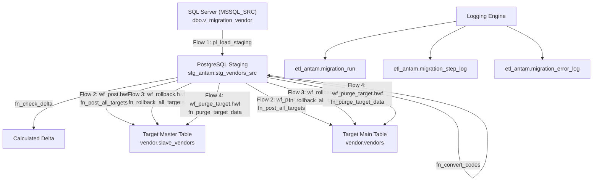

# Dokumen Spesifikasi Teknis (Technical Specification & Architecture)
## Sistem ETL & Migrasi Data (SQL Server → PostgreSQL) | Apache Hop

---

## 1. Arsitektur Sistem & Data Flow

Sistem ini dibangun berlandaskan arsitektur **Staging-based Layered ETL** dengan pemisahan tegas antara proses ekstraksi, konversi kode, posting target, rollback aman, dan purge data target.

---

## 2. Skema & Model Data Metadata (`etl_antam`)

### 2.1 Tabel Audit & Konfigurasi
1. **`etl_antam.migration_config`**:
   - Menyimpan daftar view sumber (`dbo.v_migration_vendor`), tabel target (`vendor.slave_vendors`), tabel staging (`stg_vendors_src`), primary key, dan kolom komparasi.
   - Kolom `id_seed` (`1031`) dan `id_width` (`8`) mengontrol penjagaan auto-sequence ID LPAD 8-digit.
2. **`etl_antam.migration_target_config`**:
   - Menyimpan urutan eksekusi posting (`exec_order`), tabel target (`tgt_schema`, `tgt_table`), template query INSERT (`mapping_sql`), dan template rollback (`rollback_sql`).
3. **`etl_antam.migration_run`**:
   - Menyimpan histori sesi eksekusi migrasi (Single-Record Lifecycle: Staging -> Posting -> Rollback dalam 1 baris data).
   - Kolom penting: `run_id`, `run_ts`, `main_workflow`, `config_id`, `status` (`RUNNING`, `SUCCESS`, `FAILED`), `is_posted`, `posted_at`, `post_type` (`BATCH (1000)`, `DIRECT`), `is_rolled_back`, `rolled_back_at`, `note`.
   - Kolom obsolete `rollback_of_run_id` telah dihapus demi menjamin arsitektur 1 data tunggal per siklus.
4. **`etl_antam.migration_step_log`**:
   - Catatan granular per-langkah (`PRECHECK`, `STAGING`, `CONVERT`, `DELTA`, `POST_TARGET`, `PURGE_TARGET`, `ROLLBACK`) beserta jumlah baris yang diproses.
   - Kolom audit jumlah baris: `rows_src`, `rows_stg`, `rows_new`, `rows_changed`, `rows_deleted`, serta kolom audit snapshot target:
     - `rows_before`: Jumlah record aktual pada tabel target sesaat sebelum operasi post/rollback dieksekusi.
     - `rows_after`: Jumlah record aktual pada tabel target sesaat setelah operasi post/rollback selesai.
     - `message`: Format log transparan, misalnya: `Sebelum=0, Sesudah=1031, Selisih=+1031 baris` (saat POST) atau `Sebelum=1031, Sesudah=0, Selisih=-1031 baris terhapus` (saat ROLLBACK).
5. **`etl_antam.migration_error_log`**:
   - Catatan detail kesalahan diagnostik (`error_code`, `error_message`, `error_detail`, `pipeline_name`).

---

## 3. Komponen Apache Hop (Pipelines & Workflows)

### 3.1 Workflows Principal
- **`workflows/wf_register_client_env.hwf`**: Workflow Onboarding & Master Registration. Mendaftarkan atau menyelaraskan master Client, Environment, dan koneksi database ke PostgreSQL (`master_client`, `master_environment`, `master_connection`) tanpa memicu migrasi data.
- **`workflows/wf_main.hwf`**: Main Orchestrator Flow 1 (Landing Staging, Code Conversion, Delta Check). Menghasilkan `run_id` baru dengan status `SUCCESS` dan `is_posted = false`, otomatis me-lookup master dan mencatat `client_id`, `env_id`, `client`, dan `environment`.
- **`workflows/wf_post.hwf`**: Main Orchestrator Flow 2 (Batch/Direct Multi-Target Post). Wajib parameter `RUN_ID`, `USE_BATCH`, dan `BATCH_SIZE`. Menandai `is_posted = true` dan mengisi `post_type`.
- **`workflows/wf_rollback.hwf`**: Main Orchestrator Flow 3 (Single-Record Safe Rollback Engine). Wajib parameter `RUN_ID`. Memperbarui record `RUN_ID` yang sama menjadi `is_rolled_back = true` tanpa membuat run baru.
- **`workflows/wf_purge_target.hwf`**: Main Orchestrator Flow 4 (Migrated Target Purge Engine). Parameter `CONFIG_ID` dan opsional `DELETE_IDS`.

### 3.2 Pipelines Principal
- **`pipelines/pl_register_client_env.hpl`**: Inisialisasi dan sinkronisasi data master client & environment ke tabel PostgreSQL menggunakan atomic UPSERT.
- **`pipelines/pl_init_run.hpl`**: Inisialisasi sesi `migration_run`. Melakukan lookup data master `master_client` dan `master_environment`, lalu mencatat `client_id`, `env_id`, `client`, dan `environment` ke tabel `migration_run`. Menggunakan CTE `WITH ins AS (INSERT INTO ...) SELECT ... FROM ins` untuk integritas JDBC ResultSet.
- **`pipelines/pl_get_config.hpl`**: Membaca konfigurasi aktif dari `migration_config`.
- **`pipelines/pl_load_staging.hpl`**: Penarikan data dari SQL Server view dan pendaratan ke PostgreSQL staging.
- **`pipelines/pl_purge_target.hpl`**: Memanggil fungsi database `fn_purge_target_data`.

---

## 4. Spesifikasi Fungsi Database PL/pgSQL & Stored Procedure

### 4.1 `etl_antam.fn_post_target_dispatch`
- **Tujuan**: Memposting data dari staging ke 1 tabel target dengan opsi **Batch Chunking** (`LOOP ... LIMIT p_batch_size`) atau **Direct**.
- **Audit Count Sebelum & Sesudah**:
  - Sebelum eksekusi `mapping_sql`: Menghitung `v_count_before = SELECT count(*) FROM {tgt_schema}.{tgt_table}`.
  - Setelah eksekusi posting: Menghitung `v_count_after = SELECT count(*) FROM {tgt_schema}.{tgt_table}`.
  - Selisih penambahan data: `v_diff = v_count_after - v_count_before`.
  - Disimpan ke `migration_step_log` dengan `rows_before`, `rows_after`, `rows_new = v_diff`, dan `message` memuat format `Sebelum=X, Sesudah=Y, Selisih=+Z baris`.
- **Aturan Validasi Parameter**:
  - `p_use_batch` & `p_batch_size` keduanya kosong -> Error `INVALID_PARAMETER`.
  - `p_use_batch = 'N'` -> Direct Insert (p_batch_size opsional, tanpa error).
  - `p_use_batch = 'Y'` -> Batch Insert (p_batch_size wajib > 0; jika kosong/<=0 -> Error `INVALID_BATCH_SIZE`).
  - `p_use_batch` selain 'Y'/'N' -> Error `INVALID_USE_BATCH_FLAG`.

### 4.2 `etl_antam.fn_validate_post_trigger`
- **Tujuan**: Memvalidasi kesiapan sesi `run_id` sebelum diposting ke tabel target.
- **Proteksi Guard**:
  - Memeriksa apakah `run_id` ada dan valid.
  - Memeriksa flag `is_rolled_back`: Jika sudah di-rollback (`is_rolled_back = true`), memicu error `ALREADY_ROLLED_BACK`.
  - Memeriksa flag `is_posted`: Jika sudah pernah diposting (`is_posted = true`), memicu error `ALREADY_POSTED` untuk mencegah posting ganda.

### 4.3 `etl_antam.fn_validate_rollback_trigger` & `etl_antam.fn_rollback_target_dispatch`
- **`fn_validate_rollback_trigger`**: Memvalidasi kelayakan rollback sesi `run_id`.
  - Memeriksa apakah `run_id` ada dan valid.
  - Memeriksa flag `is_posted`: Jika belum pernah diposting (`is_posted = false`), memicu error `NOT_POSTED_YET`.
  - Memeriksa flag `is_rolled_back`: Jika sudah pernah di-rollback (`is_rolled_back = true`), memicu error `ALREADY_ROLLED_BACK`.
- **`fn_rollback_target_dispatch`**: Menghapus data target yang diposting oleh sesi migrasi.
  - Menghitung `v_count_before` sebelum `DELETE` dijalankan.
  - Mengeksekusi `rollback_sql` (atau fallback DELETE berdasarkan ID/PK).
  - Menghitung `v_count_after` sesudah `DELETE` selesai.
  - Menghitung selisih data terhapus: `v_diff = v_count_before - v_count_after`.
  - Mencatat ke `migration_step_log`: `rows_before`, `rows_after`, `rows_deleted = v_diff`, dan pesan audit `Sebelum=X, Sesudah=Y, Selisih=-Z baris terhapus`.

### 4.4 `etl_antam.pr_finish_run` & `etl_antam.pr_finish_rollback_run`
- **`pr_finish_run(p_run, p_note, p_post_type)`**: 
  - Melakukan evaluasi stage-aware error filtering (langkah POST memfilter error berawalan `'POST%'`, sedangkan staging/purge memfilter error non-POST/ROLLBACK).
  - Menandai `status = 'SUCCESS'` (atau `'FAILED'`), `is_posted = true`, `posted_at = now()`, dan menyimpan `post_type` (`BATCH (1000)` / `DIRECT`).
  - Menulis rincian penambahan data ke `migration_run.note`, contoh: `wf_post selesai (mode BATCH (1000)): total +1031 baris diposting [vendor.slave_vendors (+1031), vendor.vendors (+1031)]`.
- **`pr_finish_rollback_run(p_run, p_target_run)`**:
  - Mengupdate baris `RUN_ID` yang sama di `migration_run`: `is_rolled_back = true`, `rolled_back_at = now()`, `status = 'SUCCESS'`.
  - Menulis rincian penghapusan data ke `migration_run.note`, contoh: `wf_rollback selesai: data target berhasil di-rollback. Total -1031 baris dihapus dari 2 target table.`.
  - Menjamin tidak ada baris run baru yang dibuat saat rollback.

### 4.5 `etl_antam.fn_purge_target_data`
- **Tujuan**: Menghapus data target hasil migrasi tanpa menyentuh data produksi.
- **Mekanisme Proteksi**:
  - Memeriksa adanya kolom `migration`.
  - Memeriksa bahwa baris target memiliki `(migration = '1' OR migration = 'Y')` DAN `EXISTS (SELECT 1 FROM stg_antam.<stg_table> s WHERE s.id = t.id)`.
  - Jika ID yang di-input bukan data migrasi -> Menggagalkan proses dengan error `NOT_MIGRATION_DATA` dan mencatat ke `migration_error_log`.

---

## 5. Pola Desain (Key Design Patterns)

1. **JDBC CTE Statement Pattern**:
   - Membungkus DML `INSERT ... RETURNING` di dalam CTE (`WITH ins AS (...) SELECT ... FROM ins`) agar driver PostgreSQL JDBC mengenali kembalian ResultSet dan tidak melempar `PSQLException`.
2. **Idempotent Mapping Pattern**:
   - Query `mapping_sql` menggunakan `LEFT JOIN target ON stg.pk = target.pk WHERE target.pk IS NULL`, menjamin posting data dapat dijalankan berulang kali tanpa risiko duplikasi.
3. **Single-Use Token Rollback Guard**:
   - Mencegah rollback berulang pada `run_id` yang sama demi menjaga integritas audit data.
4. **Dual-Guard Migration Data Protection**:
   - Memastikan operasi purge target secara ketat menguji `migration flag` dan keberadaan record pada staging table sebelum melakukan `DELETE`.

---
